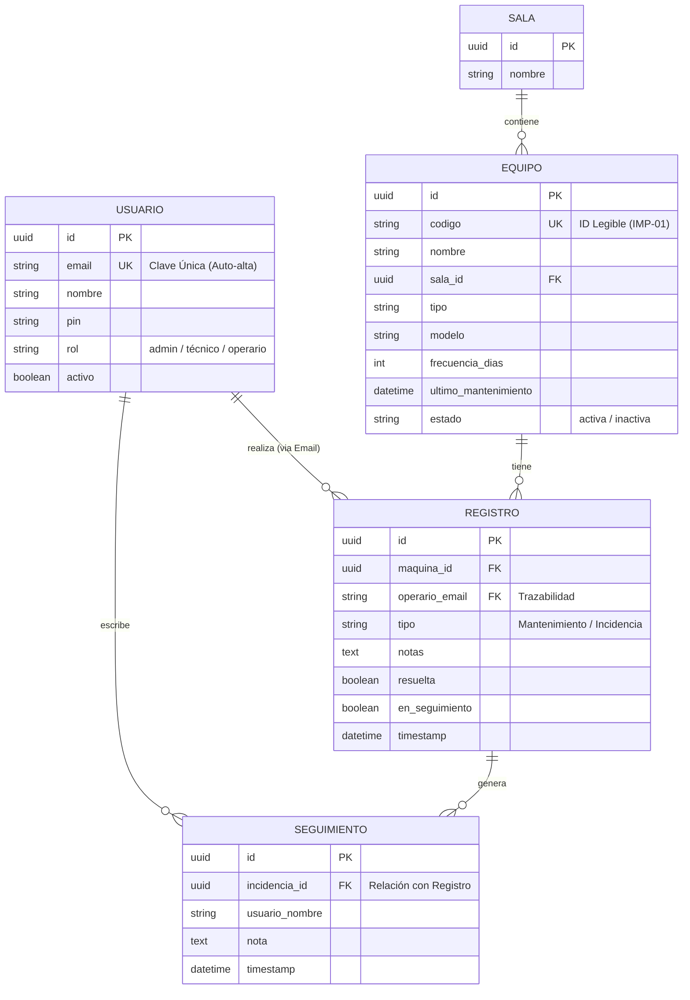

# Sistema de Gestión de Impresoras (SGI) - Documentación Técnica

## Modelo Entidad-Relación (ER)
Este modelo define la estructura de datos optimizada para la trazabilidad y el seguimiento de incidencias.

## Arquitectura de Interfaces
1. **Panel de Administración (`/dashboard.html`)**: Gestión técnica avanzada, tickets de incidencia y configuración.
2. **Interfaz de Operario (`/operario.html`)**: Acceso vía QR para reporte de mantenimiento e incidencias.
3. **Consulta Pública (`/estado.html`)**: Semáforo visual de disponibilidad para usuarios finales.

---
*Documentación actualizada automáticamente por el sistema de asistencia técnica.*
